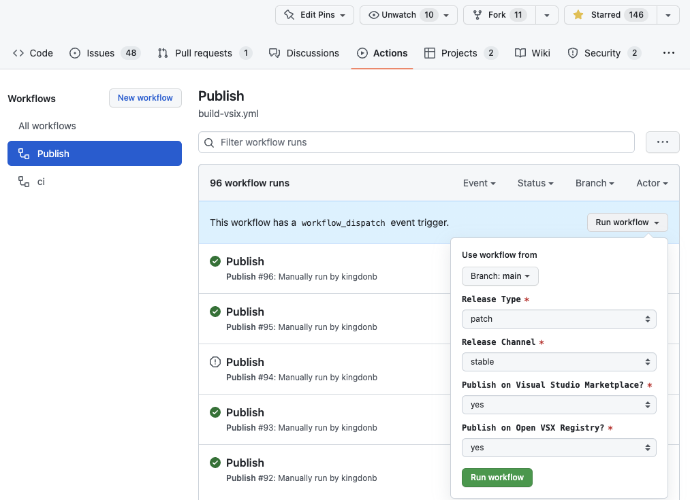

# Dev Build

Use the following commands to build GitOps vscode extension locally for testing, debugging, and submitting pull requests (PRs):

```
$ git clone https://github.com/weaveworks/vscode-gitops-tools
$ cd vscode-gitops-tools
$ npm install
$ npm run compile
$ code .
```

Watch for changes:

```
$ npm run-script watch
```

Press `F5` in VSCode to start GitOps extension debug session.

# Packaging and Installation

VSCode extensions are packaged and published with [`vsce`](https://code.visualstudio.com/api/working-with-extensions/publishing-extension) commnand line tool. Use the following steps to create GitOps extension `.vsix` package for local testing or publishing to [VSCode Marketplace](https://marketplace.visualstudio.com/vscode):

1. Install [Node.js](https://nodejs.org)
2. Install [vsce](https://github.com/microsoft/vscode-vsce): ```$ npm install -g vsce```
3. Package GitOps extension: ```$ vsce package```
4. Follow [Install from VSIX](https://code.visualstudio.com/docs/editor/extension-marketplace#_install-from-a-vsix) instructions to install the resulting `vscode-gitops-tools-0.x.0.vsix` extension package in vscode for local testing.

Install from `.vsix` file step is only required for testing the latest version of GitOps extension. Devs and DevOps will be able to download and install it from [VSCode Marketplace](https://marketplace.visualstudio.com/search?term=gitops&target=VSCode) when this vscode extension MVP is released and published.

# Releasing

In order to release a new version the extension, visit the Publish action from [build-vsix.yaml](https://github.com/weaveworks/vscode-gitops-tools/actions/workflows/build-vsix.yml) and run the workflow as a `workflow_dispatch` trigger.



Choose a branch: `main` or `edge`, and set the parameters of Release Type (major, minor, patch) then use the Release Channel (stable) or (prerelease). Stable releases correspond to the `main` branch and prereleases should come from `edge`. Note: The release will be blocked if this is incorrect.

Publish on Visual Studio Marketplace (yes), currently the Open VSX Registry is not supported.

The release process will update CHANGELOG and populate releases with a list of changes. This looks nicer if "Squash and Merge" is used when feature branches are completed.

Update the CHANGELOG after the release, or earlier for over-achievers. (You can use the generated CHANGELOG otherwise.)

It is not ever necessary to increment the version number manually in package.json, the release workflow takes care of this.

**Important:** Upon success, the Publish workflow will have created a new GitHub release, pushed the tag, added the CHANGELOG to the release body, and submitted a PR from the branch `release-pr` with a change containing the version number updates to `package.json` and `package-lock.json`, the tagged commit. The PR MUST be merged to complete the release process.

If you triggered the release, then you will be auto-tagged as a `pr_reviewer` based on `${{ github.actor }}`

Callout:
* For all future VS Code Exception developers, here is the release workflow "squash merge" exception

All PRs are expected to be "squashed when merged" except for the release-pr. You will only need to know this information if you are a maintainer merging feature contributions, or if you are actually the one physically doing releases.

* If you are merging a feature branch, it is a "Squash and merge"
* If you are merging the release-pr branch, "Create a merge commit"


It is not necessary to list this Housekeeping PR in the CHANGELOG (or the PR which updates the CHANGELOG if it is a separate PR.) The goal of the CHANGELOG is to communicate only substantive changes. If PRs are merged with the Squash Merge strategy on GitHub, then the automatic CHANGELOG generation is very neat and orderly by default.

If regular merges have been used instead, please neaten the CHANGELOG when it is updated as it will have an entry for each and every commit, and this may look very messy. (This is why we squash feature branches.)

The `release-pr` branch is updated after the workflow succeeds for **EVERY** release, including edge and stable releases. It must be merged or pulled into the base branch else the release workflow **will fail** on subsequent attempts to publish further releases. It needs to know the last tag that was used, it does read `package.json` rather than try to find this out by scanning the branch history for a previous tag.

If you are doing an edge release, there is no CHANGELOG generated since edge releases are for moving fast and breaking things. Therefore edge branches, like spike commits or spike branches, usually shouldn't be merged at all when they are done, but abandoned instead. Feature branches when they have been vetted thoroughly should be squashed and re-written, or cherry-picked for inclusion in the main branch. It's never safe to assume that anything else which has been merged into the edge branch can be released to stable now without reviewing everything first.

(If you are confident that you have not broken anything, and there aren't any other unreviewed changes in the edge branch, it should be safe to squash and merge it back to the main branch only before a MINOR release. This is OK because the patch number must be maintained internally as semver, but it is not significant in edge releases due to a quirk of the VS Code Extension marketplace.)

Our release process for the VS Code Extension Marketplace was not an original creation designed entirely in-house: see [The GitHub Action You Need to Publish VS Code Extensions](https://www.stateful.com/blog/the-github-action-you-need-to-publish-vscode-extensions) for the original work which was modified very slightly to make the [build-vsix.yaml](/.github/workflows/build-vsix.yaml) workflow that is used here.
