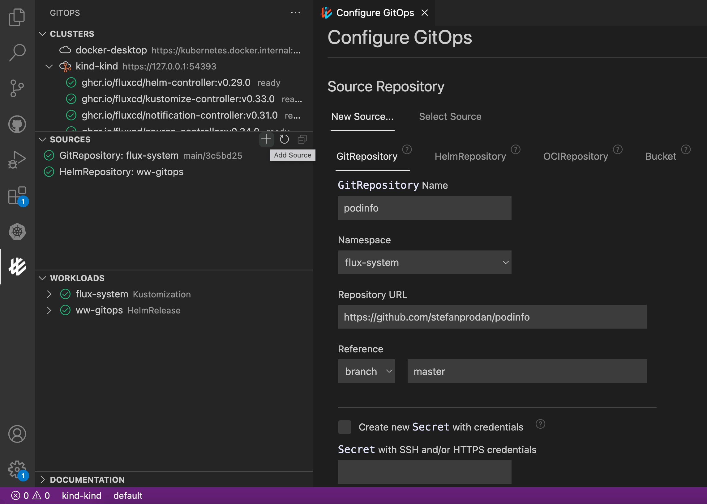
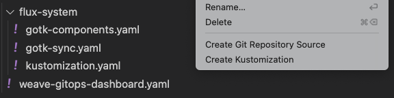
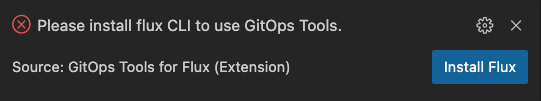
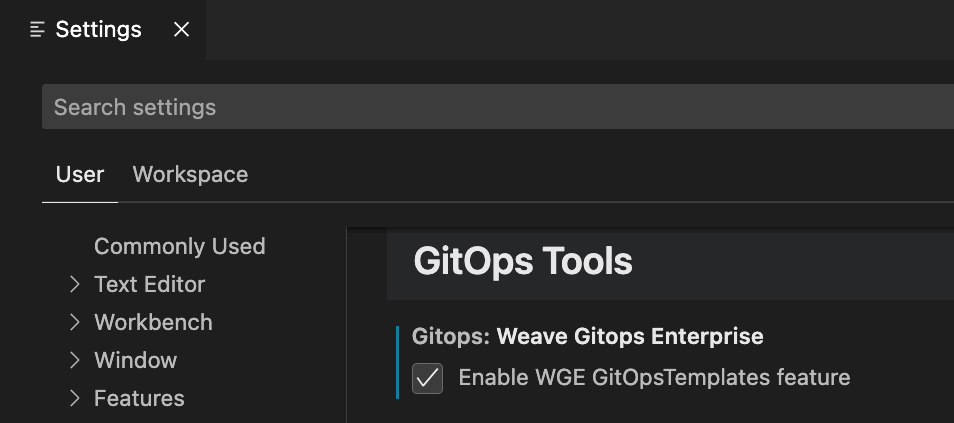
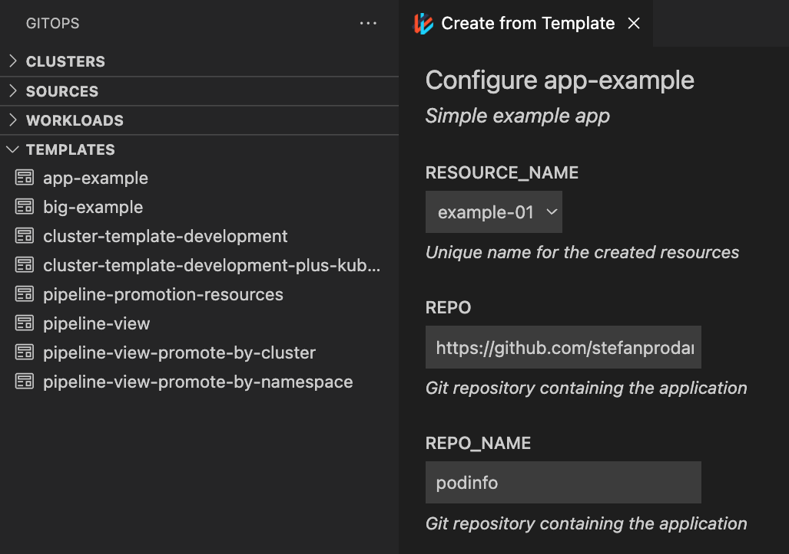

# GitOps Tools for Visual Studio Code

Weaveworks [GitOps Tools Extension](https://marketplace.visualstudio.com/items?itemName=Weaveworks.vscode-gitops-tools) provides an intuitive way to manage, troubleshoot and operate your Kubernetes environment following the GitOps operating model. GitOps accelerates your development lifecycle and simplifies your continuous delivery pipelines. The extension is built on Flux (a CNCF open source project). To learn more about the Flux GitOps toolkit, visit [fluxcd.io]

Use this extension to visualize, configure and debug Flux objects (sources and workloads) needed for GitOps workflows. For example, with this extension you can create a Flux `GitRepository` source object that tracks a Git repository containing Kubernetes manifests for your application. Then add a `Kustomization` workload object that periodically applies (reconciles) the manifests from the repository to your cluster. Now your Kubernetes changes are managed through **git**!

Your feedback is very important to us! Please help us by [submitting issues](https://github.com/weaveworks/vscode-gitops-tools/issues) for bugs, enhancements and share with us how you are using the extension.

> This extension is under active development with rolling beta release cycle and stable releases. Breaking changes remain a possibility.

# Getting Started

## Requirements

There are a few requirements before installing and using the extension:
- Install the `kubectl` [command-line tool](https://kubernetes.io/docs/tasks/tools/)
- You must have a working cluster selected in the `kubectl` config. A `kind` or Docker Desktop cluster is an easy way to get started. More information about kubeconfigs is available [here](https://github.com/vscode-kubernetes-tools/vscode-kubernetes-tools#working-with-kubeconfigs)
- The `flux` tool is required and can be installed from this extension
- Additional [dependencies](#dependencies) for Weave GitOps Enterprise and Azure users

Once you have satisfied these requirements you can find and install GitOps Tools in the [Extension Marketplace](https://marketplace.visualstudio.com/items?itemName=Weaveworks.vscode-gitops-tools) by searching for "**fluxcd**" or "**gitops**".

# Features
- Configure, visualize and manage Flux resources
- Tree views for Clusters, Sources, and Workloads
- Select clusters and examine installed [GitOps Toolkit components](https://fluxcd.io/docs/components/)
- Enable and Disable GitOps (install/uninstall Flux) on clusters
- Create, view and edit sources (git, OCI, Helm and Bucket), and workloads (Kustomization and HelmRelease)
- Reconcile sources and workloads on demand
- Pause and resume scheduled reconciliation
- Create GitRepository and Kustomization objects from folders opened in vscode
- Clone GitRepository source to user machine and open them in the editor
- Preview sources, workloads and other objects information with tooltips
- Open remote resources as `.yaml` files in the editor
- Trace Kubernetes objects created by workloads
- Watch Flux controller logs and `flux` CLI commands for diagnostics
- Documentation links for [Flux](https://fluxcd.io/docs) and [Weave GitOps](https://docs.gitops.weave.works/docs/intro/) embedded in the extension

# Video / Demo

We presented Flux and the GitOps Tools extension to our widest audience yet,
the VSCode Live Stream! Follow this video link to learn about a new feature
integration we built into the extension: Weave GitOps Enterprise Templates.

# GUI

## Tree Views and Resources

_(Clusters, Sources and Workflows tree views; `Kustomization` tooltip and `HelmRepository` YAML view)_

## Configure GitOps View

_(Configure GitOps view is used to create sources and workloads)_

## Context Menus

_(Right clicking in the Explorer view to create Flux objects from folders)_

## GitOps Commands

You can access GitOps tools check, CLI dependendency versions, Clusters, Sources and Workloads views Focus, Refresh and other commands by typing `GitOps` in `View -> Command Palette...` menu prompt:

# Dependencies

The extension uses several CLI commands that must be installed and available in your system `PATH`.

You will need the `kubectl` CLI tool to use this extension.

`flux` is also required but can be installed by the extension:

For users running clusters in Azure including AKS and Arc clusters, the `az` command line tool is also required.

Tool | Description | Installation
--- | --- | ---
[`kubectl`](https://kubernetes.io/docs/reference/kubectl/overview/) | The kubectl command line tool lets you control Kubernetes clusters.  | [Install Kubectl](https://kubectl.docs.kubernetes.io/installation/kubectl/)
[`flux`](https://fluxcd.io) | Flux is a set of continuous and progressive delivery solutions for Kubernetes. | [Install Flux CLI](https://fluxcd.io/docs/installation/#install-the-flux-cli)
[`git`](https://git-scm.com) | Git is a free and open source distributed version control system. | [Install git](https://git-scm.com/downloads)

Optional tools:

Tool | Description | Installation
--- | --- | ---
[`gitops`](https://docs.gitops.weave.works/docs/installation/weave-gitops-enterprise/#installing-weave-gitops-enterprise) | Weave GitOps Enterprise (WGE) CLI (required for Templates feature) | [Install WGE CLI](https://docs.gitops.weave.works/docs/installation/weave-gitops-enterprise/#7-install-the-cli)
[`az`](https://docs.microsoft.com/en-us/cli/azure/) | Azure CLI. (only if using the extension to create or register Azure clusters) | [Install az](https://docs.microsoft.com/en-us/cli/azure/install-azure-cli)
[`docker`](https://www.docker.com) | Docker is an open platform for developing, shipping, and running applications. | [Install Docker](https://docs.docker.com/get-docker/)

If the extension needs one of the core Kubernetes tools and they are missing, it will prompt you to install them.

The GitOps Tools Extension depends on the [Kubernetes Tools](https://marketplace.visualstudio.com/items?itemName=ms-kubernetes-tools.vscode-kubernetes-tools)  extension, which will be installed automatically if you don't already have it.

## Azure recommendations

- Make sure you have [successfully authenticated](https://docs.microsoft.com/en-us/cli/azure/authenticate-azure-cli) on your `az` CLI and have access to the [correct subscription](https://docs.microsoft.com/en-us/cli/azure/account?view=azure-cli-latest#az_account_set) for your AKS or ARC cluster.
- The easiest way to get your AKS or Arc cluster visible by the GitOps and Kubernetes Extensions, is to use the `az` CLI to merge the kubeconfig for accessing your cluster onto the default `kubectl` config. Use `get-credentials` as shown in the [official CLI documentation](https://docs.microsoft.com/en-us/cli/azure/aks?view=azure-cli-latest#az_aks_get_credentials). In order to enable GitOps in a cluster you will likely need the `--admin` credentials.

## Weave GitOps Enterprise (WGE) Templates

WGE users can access GitOpsTemplates directly from this extensions. Templates are provided by cluster administrators (Platform Teams) and can be used to quickly create cluster and configure applications with GitOps.

Templates are an opt-in feature that must be enabled in setting:

After that they can be seen in a new 'Templates' view. Right-click a template to use it:

# Common Issues

### _There are no clusters showing in my Clusters pane_

We rely on the Kubernetes extension to discover and connect to clusters. If you are having issues accessing or viewing your cluster, follow the [documentation provided by the Kubernetes extension](https://github.com/Azure/vscode-kubernetes-tools#working-with-kubeconfigs).

Confirm that your configuration context shows in a terminal running `kubectl config get-contexts`

### _Switching from an unreachable cluster context to a working cluster_

Unreachable or laggy clusters can create long running that cluster resource queries that finish after switching to a working cluster context. This can lead to the slow cluster data overwriting current cluster treeview. **Clusters** -> **Refresh** button will reinitialize the views with current data. Timeout settings can be adjusted under **GitOps** section in VSCode Settings.

# Data and Telemetry

The GitOps Tools Extension for Visual Studio Code collects usage data and sends it to Weaveworks to help improve our products and services. Read our [privacy statement](https://www.weave.works/weaveworks-privacy-policy/) to learn more. This extension respects the `telemetry.enableTelemetry` setting.

[FluxCD.io]: https://fluxcd.io/

# Installation Options

## VSCodium

VSCodium user can search and install from the VSCodium [Open-VSX](https://open-vsx.org/extension/weaveworks/vscode-gitops-tools) extension registry.

## Manual Installation

1. Download the latest `vsix` artifact version from our [Releases](https://github.com/weaveworks/vscode-gitops-tools/releases) page.
2. Run `code --install-extension gitops-tools-$VERSION.vsix`
